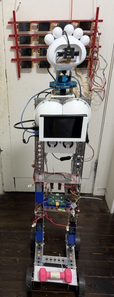
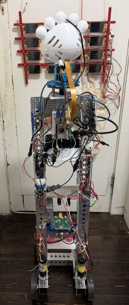

# Robot Wife — Jessica

<p align="center">
  
  &nbsp;&nbsp;
  
</p>

A personal robotics project: a conversational, physically expressive companion robot called **Jessica**. She drives around on four wheels, moves her head with a pan-tilt servo, lights up her LED hair, sees through a stereo USB camera, listens via microphone, and speaks through a USB speaker — all coordinated by a Raspberry Pi 5 running ROS 2 and an ESP32-S3 handling the low-level motor and servo control.

---

## Hardware Overview

| Component | Details |
|-----------|---------|
| **Brain** | Raspberry Pi 5 |
| **Motor / Servo Controller** | Custom ESP32-S3 PCB (PlatformIO/Arduino firmware) |
| **Drive system** | 4-wheel differential drive, 4× motors with 1425 CPR quadrature encoders |
| **Motor drivers** | 4× VNH7040 H-bridge ICs controlled via MCP23017 I2C GPIO expander — [GitHub repo](https://github.com/jonathanrandall/four_motor_controller) containing KiCad schematic, PCB layout and bill of materials / [build video](https://youtu.be/qtjofj0y1YY) |
| **Head** | [Poppy Eva Head](https://github.com/poppy-project/Poppy-eva-head-design) — pan-tilt mount with 2× bus servos (xArm-compatible) |
| **Head servo controller** | ESP32 running MicroPython — bridges UART commands from the Pi to the servo bus |
| **Hair LEDs** | 5× WS2811 addressable LEDs via Raspberry Pi SPI (GPIO 10 / MOSI) |
| **Face display** | Waveshare 7" touchscreen — animated UI (listening / thinking / talking / idle) |
| **Stereo camera** | USB 3D stereo camera — published as compressed JPEG at 30 Hz |
| **ToF depth camera** | Arducam ToF (CSI) — published as lossless PNG depth map at 10 Hz |
| **Speaker** | USB audio device — text-to-speech via Piper TTS (on laptop) |
| **Microphone** | USB audio device — speech recognition via Whisper (on laptop) |
| **PC** | Any Linux machine with a GPU — runs MediaPipe pose/hand estimation, Whisper STT, Piper TTS, and Ollama |
| **Power** | LiPo battery with buck converter; 3D-printed battery holder |

---

## Repository Structure

```
robot_wife/
├── esp32_bridge/                # ESP32-S3 PlatformIO firmware (motors + drive servos)
│   ├── src/
│   │   ├── main.cpp                   — entry point, configuration, FreeRTOS tasks
│   │   ├── Motor.cpp                  — VNH7040 H-bridge driver (PWM + encoder)
│   │   ├── Mcp23017Bus.cpp            — I2C GPIO expander driver
│   │   ├── QuadratureEncoder.cpp      — hardware PCNT quadrature decoder
│   │   ├── PIDController.cpp          — general-purpose PID
│   │   ├── RobotController.cpp        — differential drive kinematics + 4× PID
│   │   ├── PanTiltController.cpp      — servo pan-tilt head control
│   │   └── WebDashboard.cpp           — WiFi web UI + REST telemetry API
│   ├── include/                       — corresponding header files
│   └── DOCUMENTATION.md              — detailed ESP32 firmware reference
│
├── micropython_servo_control/   # MicroPython firmware for the head servo ESP32
│   ├── main.py                        — UART serial bridge → xArm bus servo protocol
│   ├── config.py                      — servo IDs, limits, unit↔radian mapping
│   ├── BusServo.py                    — half-duplex bus servo driver
│   └── Oled.py                        — optional OLED status display
│
├── from_pi/                     # ROS 2 packages that run on the Raspberry Pi
│   ├── launcher/
│   │   └── jessica_launcher.py        — touch-screen power-on menu (no ROS needed)
│   └── src/
│       ├── jessica_robot/             — main robot package
│       │   ├── jessica_robot/
│       │   │   ├── jessica_chatbot.py       — AI conversation loop (Ollama LLM)
│       │   │   ├── hair_led_node.py         — WS2811 LED strip ROS node
│       │   │   ├── pan_tilt_teleop.py       — joystick head control node
│       │   │   ├── person_follower.py       — base + head follow person (visual servo)
│       │   │   ├── finger_follower.py       — head tracks raised index finger
│       │   │   └── stop_gesture.py          — raised-palm stop detection
│       │   ├── config/                — controller YAML, joystick mapping, twist_mux
│       │   ├── tools/
│       │   │   └── build_examples.py        — build few-shot / fine-tune examples from logs
│       │   └── launch/
│       │       └── jessica.launch.py        — full system launch file
│       ├── jessica_description/       — URDF / xacro robot model
│       ├── jessica_display/           — Waveshare 7" touchscreen UI (pygame/KMS)
│       │   └── jessica_display/
│       │       └── display_node.py          — listening/thinking/talking/idle animations
│       ├── esp32_combined_hardware/   — ros2_control hardware interface (wheels + head servos)
│       │   └── src/
│       │       ├── esp32_combined_hardware.cpp — serial bridge to ESP32
│       │       └── joy_button_bridge.cpp       — joystick buttons → ROS topics
│       ├── esp32_servo_hardware/      — ros2_control hardware interface (head servos only)
│       ├── camera_publisher/          — USB stereo camera → /jessica/camera/image/compressed
│       └── tof_publisher/             — Arducam ToF → /jessica/tof/image/compressed
│
├── robot_pc_ws/                 # ROS 2 workspace that runs on the GPU laptop / PC
│   └── src/
│       └── stereo_pose_publisher/     — MediaPipe pose + hand estimation on stereo frames
│           └── stereo_pose_node.py          — publishes PersonState + HandState
│
├── text_to_speech/              # Laptop-side servers
│   ├── whisper_server.py              — faster-whisper STT server (CUDA, port 8765)
│   └── tts_server.py                  — Piper TTS server (port 8766)
│
└── 3d_prints/                   # FreeCAD macros and STL files for printed parts
    ├── macros/                        — FreeCAD parametric macros (.FCMacro)
    └── *.stl                          — ready-to-print STL files
```

---

## Software Architecture

```
                         Raspberry Pi 5
┌──────────────────────────────────────────────────────────────┐
│                                                              │
│  jessica_launcher.py  (systemd, no ROS)                      │
│    └─ touch-screen menu → spawns / stops ros2 launch         │
│                                                              │
│  jessica_chatbot.py                                          │
│    ├─ records microphone (sounddevice)                       │
│    ├─ transcribes via Whisper server (HTTP → PC)             │
│    ├─ sends conversation to Ollama (HTTP → PC)               │
│    ├─ synthesises speech reply via TTS server (HTTP → PC)    │
│    ├─ plays audio (aplay → USB speaker)                      │
│    ├─ logs every turn to ~/jessica_ws/logs/ (JSONL)          │
│    ├─ publishes /jessica/hair_hue    (Int32)                 │
│    ├─ publishes /jessica/ui_state    (String → display)      │
│    ├─ publishes /jessica/speech_env  (Float32MultiArray)     │
│    ├─ publishes /cmd_vel             (Twist, autonomous)     │
│    └─ publishes /pan_tilt_controller/joint_trajectory        │
│                                                              │
│  display_node.py                                             │
│    └─ /jessica/ui_state + /jessica/speech_env → Waveshare 7"│
│                                                              │
│  hair_led_node.py                                            │
│    └─ /jessica/hair_hue → WS2811 LEDs (SPI)                 │
│                                                              │
│  webcam_publisher.py   → /jessica/camera/image/compressed    │
│  tof_publisher.py      → /jessica/tof/image/compressed       │
│                                                              │
│  pan_tilt_teleop.py  (joystick head)                         │
│  person_follower.py  (follow person; toggled by chatbot)     │
│  finger_follower.py  (follow finger; toggled by chatbot)     │
│                                                              │
│  twist_mux  (joystick > chatbot > follower priority)         │
│    └─ → /diff_cont/cmd_vel                                   │
│                                                              │
│  esp32_combined_hardware  (ros2_control plugin)              │
│    ├─ diff_cont → USB serial → ESP32-S3 (motors + encoders) │
│    └─ pan_tilt_controller → UART → MicroPython ESP32 →      │
│                             bus servos (pan + tilt)          │
│                                                              │
└──────────────────────────────────────────────────────────────┘
         │ USB serial (115200)        │ UART (115200)
         ▼                            ▼
    ESP32-S3 Firmware          MicroPython ESP32
┌─────────────────────┐   ┌──────────────────────────┐
│ 4× PID motor loops  │   │ xArm bus servo protocol  │
│ Serial ROS bridge   │   │ pan servo (ID 6)         │
│ WiFi web dashboard  │   │ tilt servo (ID 5)        │
└─────────────────────┘   └──────────────────────────┘

                         GPU Laptop / PC
┌──────────────────────────────────────────────────────────────┐
│  whisper_server.py  (port 8765) — faster-whisper CUDA STT   │
│  tts_server.py      (port 8766) — Piper TTS synthesis       │
│  Ollama             (port 11434) — local LLM (llama3.2:3b)  │
│  stereo_pose_node.py — MediaPipe on stereo frames           │
│    ├─ publishes /jessica/person_state  (PersonState)         │
│    └─ publishes /jessica/hand_state    (HandState)           │
└──────────────────────────────────────────────────────────────┘
```

---

## ESP32-S3 Motor Firmware

The firmware lives in `esp32_bridge/` and is built with PlatformIO (Arduino framework). See [`esp32_bridge/DOCUMENTATION.md`](esp32_bridge/DOCUMENTATION.md) for the full software reference including pin assignments, PID tuning guide, serial protocol, and web API.

### Quick summary

- **4-wheel differential drive** with independent closed-loop PID speed control per wheel
- **Quadrature encoder** reading via ESP32-S3 hardware PCNT peripheral (64-bit position)
- **VNH7040** H-bridge motor drivers; direction and MultiSense current sensing via MCP23017
- **ROS 2 serial interface** at 115200 baud — accepts wheel speed commands, returns encoder velocities
- **Serial watchdog** — motors stop automatically if no command received for 1 second
- **WiFi web dashboard** at `http://robot.local` — telemetry, manual drive, PWM readout

### Build and flash

```bash
cd esp32_bridge
pio run --target upload
pio device monitor
```

### WiFi configuration

Edit the top of `esp32_bridge/src/main.cpp`:

```cpp
const char* WIFI_SSID     = "your-network";
const char* WIFI_PASSWORD = "your-password";
```

---

## MicroPython Head Servo Controller

The pan-tilt head uses xArm-compatible bus servos driven by a separate ESP32 running MicroPython. Code is in `micropython_servo_control/`.

`main.py` listens for newline-terminated text commands on two links simultaneously:

- **UART1** (pins 16/17) — the Pi link, used by `esp32_servo_hardware` (ros2_control)
- **USB serial** — for bench testing from a laptop

### Command protocol

| Command | Example | Description |
|---------|---------|-------------|
| `ptr <pan_rad> <tilt_rad> [ms]` | `ptr 0.5 -0.3 1000` | Move both axes in radians |
| `pr <rad> [ms]` | `pr 0.5` | Pan only (radians) |
| `tr <rad> [ms]` | `tr -0.3` | Tilt only (radians) |
| `pt <pan> <tilt> [ms]` | `pt 600 400` | Move both in servo units (0–1000) |
| `pos` | `pos` | Report current positions |

Every command gets a JSON reply shaped like `sensor_msgs/JointState`:

```json
{"name": ["pan_joint", "tilt_joint"], "position": [0.0, -0.3]}
```

Servo units: 500 = 0 rad, 0 = −135°, 1000 = +135°. Per-servo limits and direction signs are in `config.py`.

---

## ROS 2 Setup (Raspberry Pi)

The Pi runs **ROS 2 Jazzy**. All packages live in `from_pi/src/` and are built with colcon.

```bash
cd from_pi
colcon build
source install/setup.bash

# Full robot (hardware + cameras + chatbot + display)
ros2 launch jessica_robot jessica.launch.py

# Chatbot + LEDs only (no ESP32 / joystick)
ros2 launch jessica_robot jessica.launch.py hardware:=false
```

### Key ROS topics

| Topic | Type | Publisher → Subscriber |
|-------|------|------------------------|
| `/jessica/hair_hue` | `std_msgs/Int32` | chatbot → hair_led_node |
| `/jessica/ui_state` | `std_msgs/String` | chatbot → display_node |
| `/jessica/speech_env` | `std_msgs/Float32MultiArray` | chatbot → display_node |
| `/jessica/touch` | `geometry_msgs/Point` | display_node → chatbot |
| `/jessica/camera/image/compressed` | `sensor_msgs/CompressedImage` | camera_publisher → PC |
| `/jessica/tof/image/compressed` | `sensor_msgs/CompressedImage` | tof_publisher → PC |
| `/jessica/person_state` | `PersonState` | PC stereo_pose_node → person_follower |
| `/jessica/hand_state` | `HandState` | PC stereo_pose_node → finger_follower |
| `/jessica/person_follow/enable` | `std_msgs/Bool` | chatbot → person_follower |
| `/jessica/finger_follow/enable` | `std_msgs/Bool` | chatbot → finger_follower |
| `/cmd_vel` | `geometry_msgs/Twist` | chatbot (autonomous) → twist_mux |
| `/cmd_vel_joy` | `geometry_msgs/Twist` | joystick teleop → twist_mux |
| `/diff_cont/cmd_vel` | `geometry_msgs/Twist` | twist_mux → diff drive controller |
| `/pan_tilt_controller/joint_trajectory` | `trajectory_msgs/JointTrajectory` | chatbot / teleop → head controller |
| `/joy` | `sensor_msgs/Joy` | joy_node → teleop nodes |

---

## AI Chatbot — Jessica

`jessica_chatbot.py` implements the full conversation loop:

1. **Listen** — records microphone until a pause is detected
2. **Transcribe** — sends WAV to the laptop Whisper server (`POST /transcribe`)
3. **Think** — sends conversation history to Ollama (`llama3.2:3b` by default)
4. **Execute** — parses JSON response for a robot command (`drive`, `turn`, `look`, `wave`, `nod`, `shake_head`, `change_hair_color`, `stop`, or `none`)
5. **Speak** — requests synthesised audio from the TTS server, plays through USB speaker
6. **Log** — appends a turn record to `~/jessica_ws/logs/jessica_YYYY-MM-DD.jsonl`

Jessica only acts on robot commands when the user begins with **"Jessica darling"**.

### Conversation states

| State | Behaviour |
|-------|-----------|
| `IDLE` | Listens indefinitely; any speech starts a conversation |
| `CONVERSATION` | Active conversation; 30 s silence returns to IDLE |
| `DORMANT` | Silent after "bye Jessica"; wakes on "Jessica darling" / "hello Jessica" |

### Spoken feedback logging

Say a feedback phrase immediately after Jessica acts to label the turn for later training:

- **Approval** — "good girl", "well done", "that was perfect" → logs `label: good`
- **Correction** — "that was wrong", "wrong Jessica" → logs `label: bad` with your spoken words

`from_pi/src/jessica_robot/tools/build_examples.py` processes the logs into few-shot examples or fine-tuning pairs:

```bash
python3 src/jessica_robot/tools/build_examples.py --prompt   # print confirmed examples
python3 src/jessica_robot/tools/build_examples.py --label bad # review corrections
```

---

## Face Display

`display_node.py` drives the Waveshare 7" touchscreen using **pygame over KMS/DRM** (no desktop required). It subscribes to `/jessica/ui_state` and `/jessica/speech_env` and renders:

| State | Visual |
|-------|--------|
| `listening` | "Listening..." text, ping-pong pink→yellow hue cycle |
| `thinking` | "Thinking..." text, ping-pong green→blue hue cycle |
| `talking` | Animated soundwaves, amplitude driven by speech envelope |
| `idle` | Dim breathing dot, low frame rate |

Touch events are published on `/jessica/touch`.

The `jessica_launcher.py` script provides a three-button power-on menu (Start Jessica / Chatbot Only / Drive Mode) that runs before ROS and releases the display to `jessica_display` when a stack is started. Hold the screen for 3 seconds to stop the stack and return to the menu.

---

## Vision — Person and Finger Following

Two visual-servo nodes run on the Pi and are voice-toggled by the chatbot (say **"Jessica darling, follow me"** / **"Jessica darling, stop following"**):

- **`person_follower.py`** — head and base follow the person's shoulder midpoint. Auto-stops if the person turns to face the robot or raises an open palm.
- **`finger_follower.py`** — head tracks a raised index finger; only the head moves.

Both rely on `PersonState` and `HandState` messages published by `stereo_pose_node.py` running on the PC (MediaPipe PoseLandmarker + HandLandmarker on rectified stereo frames).

---

## Laptop / PC Services

All GPU-intensive work is offloaded to a laptop or desktop on the same LAN.

### Whisper STT server (port 8765)

```bash
cd text_to_speech
pip install fastapi uvicorn faster-whisper
python whisper_server.py
```

Override model or port: `WHISPER_MODEL=medium.en WHISPER_PORT=8765 python whisper_server.py`

### Piper TTS server (port 8766)

```bash
cd text_to_speech
pip install fastapi uvicorn piper-tts numpy
python tts_server.py
```

The voice model is bundled in `text_to_speech/voices/`. Override: `TTS_VOICE_MODEL=/path/to/model.onnx python tts_server.py`

### MediaPipe pose estimator (robot_pc_ws)

```bash
cd robot_pc_ws
colcon build
source install/setup.bash
ros2 launch stereo_pose_publisher stereo_pose.launch.py
```

Update `WHISPER_URL`, `OLLAMA_URL`, and `TTS_URL` at the top of `jessica_chatbot.py` to match your PC's IP address.

---

## Hair LED Node

`hair_led_node.py` controls a strip of **5× WS2811** LEDs via Raspberry Pi SPI. Subscribes to `/jessica/hair_hue` (Int32):

| Value | Colour |
|-------|--------|
| 0–359 | HSV hue in degrees (S=100%, V=80%) |
| -1 | White |
| -2 | Rainbow (each LED a different colour) |

**Wiring:** data → GPIO 10 (SPI0 MOSI, physical pin 19). Enable SPI in `/boot/firmware/config.txt`:

```
dtparam=spi=on
```

---

## 3D Printed Parts

All STL files and FreeCAD macros are in `3d_prints/`.

| File | Description |
|------|-------------|
| `battery_holder.stl` | LiPo battery mount |
| `buck_converter_mount.stl` | Voltage regulator bracket |
| `camera_stand_final_v6-Body.stl` | USB stereo camera stand |
| `led_boobs.stl` / `wife_boobs_v2_13.stl` | LED diffuser enclosures |
| `light_diffuser_Sphere.stl` | Hemisphere light diffuser |
| `mount_holders.stl` | General component mounts |
| `pi_holder.stl` | Raspberry Pi mount |
| `servo_head_connection-Body.stl` | Pan-tilt servo bracket |
| `Speaker_Box.stl` | USB speaker enclosure |
| `Switch_holderv2.stl` | Power switch holder |
| `macros/` | FreeCAD `.FCMacro` parametric source files |

---

## Security Notes

This project assumes a **trusted private LAN**. Nothing here should be exposed to the internet.

- **WiFi credentials** belong only in `esp32_bridge/src/main.cpp`, committed with an **empty password field**. Fill it in locally and do not commit the change.
- **The ESP32 web dashboard has no authentication.** Keep the robot on a private network.
- **The Whisper, TTS, and Ollama servers are unauthenticated** and bind to `0.0.0.0`. Run them only behind your router's firewall.
- No API keys, tokens, or private keys are used anywhere — all AI services run locally.

---

## License

The software and hardware designs in this repository are released under two licenses:

- **MIT License** — all software, firmware, and original hardware designs. See [LICENSE](LICENSE).

- **Creative Commons License** — the robot head is based on the **[Poppy Eva Head](https://github.com/poppy-project/Poppy-eva-head-design)** by the Poppy Project. The original design is released under the [Creative Commons Attribution-ShareAlike 4.0 International (CC BY-SA 4.0)](https://creativecommons.org/licenses/by-sa/4.0/) license. Any derivative head designs in this repository are shared under the same CC BY-SA 4.0 terms.
